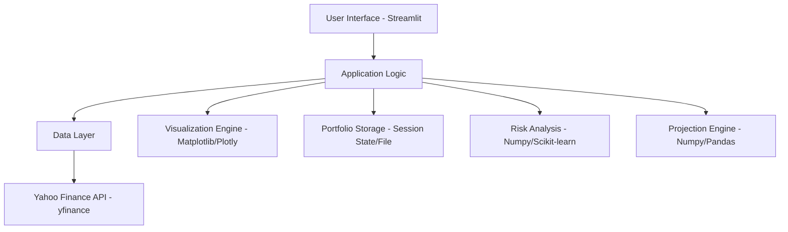

# Four Fund Portfolio Planner - Planning Document

This document outlines the technical plan, architecture, and design decisions for the Four Fund Portfolio Planner web application.

## Project Goals

The primary goal is to create an interactive Streamlit application that allows users to explore different portfolio allocations using four specific low-cost, broad-market index funds (VTI, VEA, BND, BNDX) and visualize the impact of these allocations on historical performance and risk.

## Architecture

The application will follow a layered architecture:

1.  **UI Layer:** Handles user interaction and displays information using Streamlit components.
2.  **Application Logic Layer:** Contains the core logic for processing user inputs, performing calculations, and coordinating between the UI and Data layers.
3.  **Data Layer:** Responsible for fetching, caching, and providing financial data from Yahoo Finance.

## Technical Stack

-   **Frontend/Backend Framework:** Streamlit (Python)
-   **Data Fetching:** `yfinance` (Python library for Yahoo Finance data)
-   **Data Manipulation:** `pandas` (Python library for data analysis)
-   **Numerical Operations:** `numpy` (Python library for numerical computing)
-   **Visualization:** `matplotlib` or `plotly` (Python libraries for plotting)
-   **Risk Analysis:** `numpy`, `pandas`, potentially `scikit-learn` for statistical functions.
-   **Portfolio Storage:** Streamlit's session state for temporary storage, potentially file-based storage for saving/loading (implemented basic JSON file save/load).
-   **Testing Framework:** `pytest`

## Data Handling

-   Fund data (yield, expense ratio, beta, historical prices) will be fetched using `yfinance`.
-   Data will be cached using a basic in-memory dictionary to avoid excessive API calls, especially for historical data.
-   Historical price data will be used to calculate historical returns for individual funds and the overall portfolio.

## Portfolio Calculation Logic

-   **Allocation:** User inputs will determine the percentage allocation for each of the four funds.
    -   `Total Stocks %` (User Input)
    -   `Total Bonds %` = `100% - Total Stocks %`
    -   `International Stocks %` (User Input, applied to `Total Stocks %`)
    -   `US Stocks %` = `Total Stocks % * (100% - International Stocks %)`
    -   `International Stocks %` (within portfolio) = `Total Stocks % * International Stocks %`
    -   `International Bonds %` (User Input, applied to `Total Bonds %`)
    -   `US Bonds %` = `Total Bonds % * (100% - International Bonds %)`
    -   `International Bonds %` (within portfolio) = `Total Bonds % * International Bonds %`
-   **Historical Returns:** Portfolio historical returns will be calculated as the weighted average of the individual fund historical returns based on the selected allocation. Rebalancing will *not* be assumed for simplicity as per user request.
    -   Interpolation logic is used to estimate historical Max, Avg, and Min annual returns for specific stock/bond allocation percentages based on provided data for 10% increments.
-   **Risk Metrics:** Volatility (standard deviation of returns) and Sharpe Ratio will be calculated based on historical portfolio returns.
-   **Projections:** Future performance projections will be based on historical data, likely using annualized historical returns as a simple projection method. More sophisticated methods could be considered later if needed.

## Visualization Details

-   **Fund Details Table:** A pandas DataFrame displayed as a table in Streamlit.
-   **Pie Charts:** Using `matplotlib` or `plotly` to generate pie charts for the specified allocation breakdowns.
-   **Historical Performance Graph:** A line chart showing the cumulative returns of the selected portfolio over 1, 3, 5, and 10 years.

## Additional Features Implementation

-   **Saving/Loading:** Basic JSON file save/load of portfolio configurations is implemented. (Note: Seamless slider update on load requires further work).
-   **Comparison:** Placeholder added for allowing users to define multiple portfolios and display their key metrics and performance side-by-side.
-   **Risk Metrics:** Display of calculated volatility and Sharpe Ratio is implemented.
-   **Projections:** Display of projected future values based on historical annualized returns is implemented.
-   **Historic Stock vs. Bonds Returns Table:** A table displaying interpolated historical Max, Avg, and Min annual returns for the currently selected stock/bond allocation.

## Code Structure and Modularity

-   The application will be structured into logical Python modules (e.g., `data_fetcher.py`, `calculator.py`, `visualizer.py`, `app.py`).
-   Files will be kept under 500 lines of code.
-   PEP8 guidelines will be followed, with type hints and `black` formatting.
-   Docstrings will be included for all functions and classes using the Google style.

## Testing

-   Pytest is used for unit testing.
-   Initial unit tests covering data fetching, calculation logic, and visualization data preparation have been added in the `/tests` directory.
-   Tests are located in a `/tests` directory mirroring the main app structure.

## Documentation

-   `README.md`: User-facing documentation.
-   `PLANNING.md`: Technical planning and architecture.
-   `TASK.md`: Project task list.
-   Docstrings and inline comments for code explainability.

## Open Questions / Future Enhancements

-   Improving the seamless update of Streamlit sliders when loading a portfolio configuration.
-   Considering the use of Plotly for more interactive visualizations as an alternative to Matplotlib.
-   Specific implementation details for the projection model (could be more sophisticated).
-   Handling of potential errors during data fetching (more robust error handling).
-   More advanced risk metrics or visualization options.
-   Deployment strategy.
